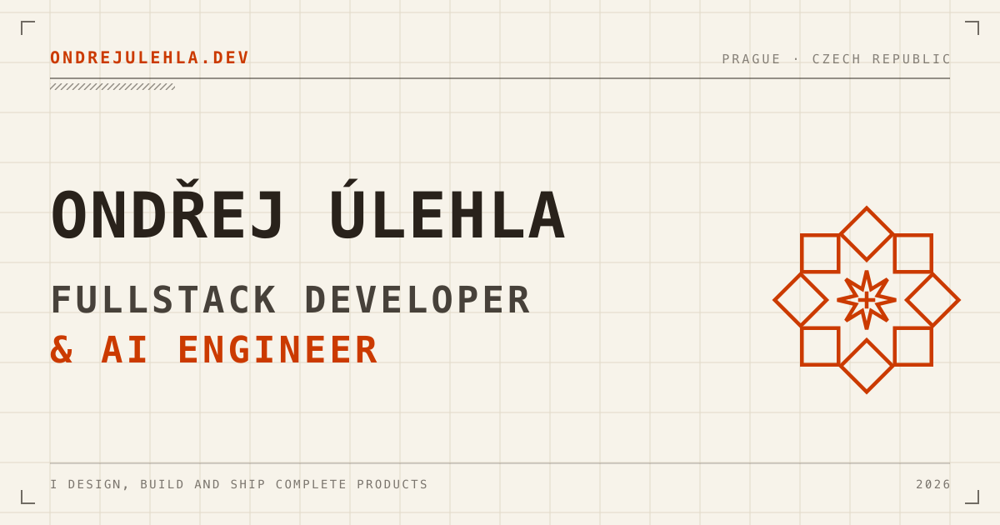

# ondrejulehla.dev

Personal portfolio of **Ondřej Úlehla** – fullstack developer & AI engineer.
Profile, CV and project case studies, plus an interactive [neural-network lab](https://ondrejulehla.dev/neural-network)
built from my master's thesis and a procedural [3D island playground](https://ondrejulehla.dev/playground).



Built with **Astro 5 / Tailwind CSS 4 / GSAP / Three.js**. Fully static output,
English-only, light/dark theme.

## Quickstart

```bash
npm install
npm run build   # astro check-friendly production build into dist/
```

<!-- readme-ci skip -->
```bash
npm run dev     # dev server on localhost:4321
```

The blocks above are executed on every push by
[readme-ci](https://github.com/ondraulehla/readme-ci), so this quickstart
cannot silently rot.

## Commands

| Command | What it does |
| --- | --- |
| `npm run dev` | Dev server on `localhost:4321` |
| `npm run build` | Production build into `dist/` |
| `npm run preview` | Serves `dist/` |
| `npm run check` | `astro check` (types) |
| `npm test` | Vitest unit tests |
| `npm run pdf` | Regenerates `public/cv/*.pdf` from the built site (needs Chrome) |
| `node scripts/gen-covers.mjs` | Regenerates the project cover plates (SVG) |
| `node scripts/gen-og.mjs` | Regenerates Open Graph share cards (needs librsvg) |

## Design language

One system everywhere – warm bone paper, ink, a single vermilion accent:

- **Technical plates** – project covers, OG cards and playground billboards
  share one generated style: hairline grid, crop marks, mono spec labels and
  an engraved line diagram per project ([scripts/gen-covers.mjs](scripts/gen-covers.mjs)).
- **LiquidText** – poster headings are SVG with gooey accent metaballs living
  strictly inside the letterforms ([src/components/ui/LiquidText.astro](src/components/ui/LiquidText.astro)).
- **Rosette emblem** – a faithful port of *rosette-1* from
  [a-single-div](https://github.com/lynnandtonic/a-single-div), reused in the
  header, footer, favicon, 404 and the plates
  ([src/components/ui/Emblem.astro](src/components/ui/Emblem.astro)).
- **Hairline cells** – header, footer, contact and project spec bands are
  bordered cells whose ink floods in from the bottom on hover (`.cell-flood`).
- The bar-built **ULEHLA** wordmark morphs into **ONDREJ** on hover
  (single-div gradient technique).

## Where content lives

- **CV data (single source of truth)** – [src/data/cv.ts](src/data/cv.ts):
  profile, experience, education, skills. Feeds both the site and the PDF.
- **Contact & links** – [src/data/site.ts](src/data/site.ts)
- **Case studies** – `src/content/projects/en/<slug>.mdx`
  (frontmatter: title, summary, role, year, tech, problem/solution/outcome, cover, links)
- **UI strings** – [src/i18n/ui.ts](src/i18n/ui.ts)
- **Colour tokens** – [src/styles/global.css](src/styles/global.css)
  (`:root` + `[data-theme='dark']`)

After changing CV data run `npm run build && npm run pdf` and commit the
regenerated PDF.

## Editing the 3D playground

The island layout is hand-editable in
[src/playground/world.ts](src/playground/world.ts) – every field is commented:

- `mountains`, `river`, `city` – terrain features (position, size, meanders)
- `roads`, `bridge`, `pier`, `fields`, `windmill` – the hand-placed landmarks
- `signSpots` – where the project billboards hover
- `forest.densityThreshold`, `fauna` – trees, birds, sheep
- `islandRadius`, `waterLevel`, `clouds.count`

Terrain/object colours live in `COLORS` and sky/lighting in `SKY` in
[src/playground/experience.ts](src/playground/experience.ts); flight physics
sit in `startExperience` (`BASE_SPEED`, bank/pitch coefficients). Run
`npm run dev` and open `/playground`.

## Architecture notes

- The main site is fully static; Three.js (~134 KB gzip) loads **only after
  the playground enter-gate click** – regular pages never touch it. The world
  is fully procedural, no GLB assets.
- The neural lab is a plain-TypeScript MLP (no ML library) training live in
  the browser; the decision surface, SVG schematic and 3D model all render
  from the same weights.
- View Transitions via `<ClientRouter />` – the project card cover morphs
  into the detail page.
- `prefers-reduced-motion` disables the animations; the playground offers a
  fallback gate.
- Anton + Inter woff2 are preloaded from the layout head.

## Deploy

Static output – any static host works. `site` in
[astro.config.mjs](astro.config.mjs) and `Sitemap:` in
[public/robots.txt](public/robots.txt) must point at the final domain.
